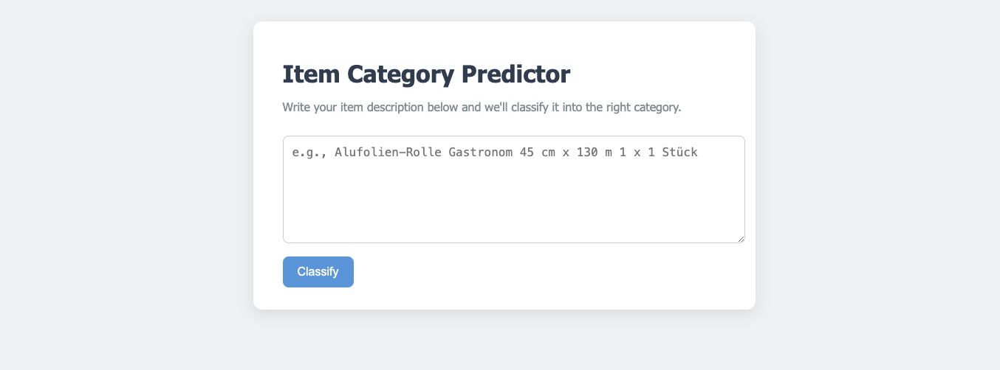

# Multiclass Text Classification for German Food Product Descriptions

This project focuses on building a multiclass text calssification model using traditional machine learning techniques to classify food product descriptions into multiple predefined categories. 

# Project Overview

- **Input:** Short product descriptions in German (max ~20 words).
- **Output:** Predicted category label from multiple classes (~350).
- **Tech Stack:** Python, Scikit-learn, Numpy, Pandas, Flask, GitHub Actions

# Features

- Preprocessing of text data
- TF-IDF feature extraction
- Model training using classical ML models (e.g., Logistic Regression, Naive Bayes)
- Performance evaluation (accuracy, F1-score, confusion matrix)
- Simple Flask-based API for serving predictions
- MLFlow for data versioning and trackign experiments
- CI pipeline using GitHub Actions for automated testing and deployment

# Results:
The results of each model on the dataset are as follows:

|  Model | Accuracy |
|----------|----------|
| Logistic Regression | 80.76% |
| Support Vector Machine | 79.73% |
| Multinomial Naive Bayes | 78.25% |
| Stochastic Gradient Descent | 79.11% |
| Randomforest | 73.8% |
| XGBoost | 65.78% |
| RNN | 62.3% |
| GRU | 62.3% |
| LSTM | 72% |

# Future Improvements

- Experiment with a BERT-based model for potentially better perfromance.

# Demo

